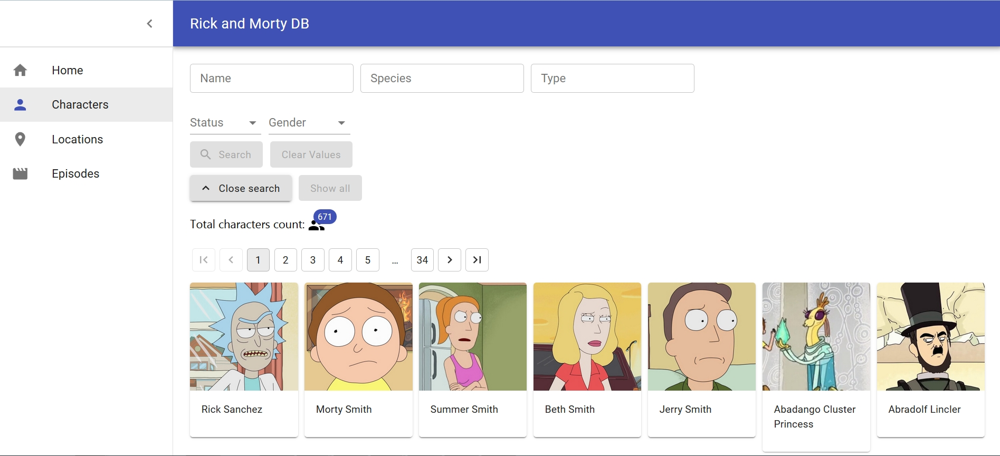
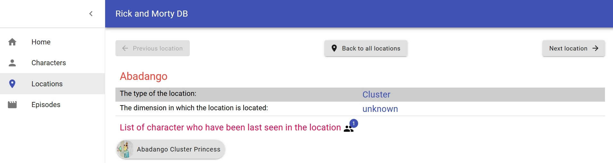
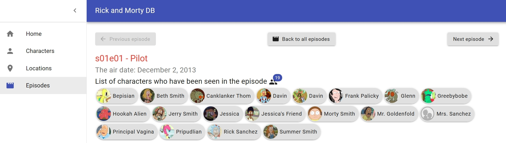

# Rick-and-Morty-DB
Ссылка: https://alexaltrex.github.io/Rick-and-Morty-DB/#/

## Описание
Мультимедийная база данных по мультсериалу "Рик и Морти", содержащая информацию по эпизодам, персонажам и локациям.

## Запуск проекта:
Для установки и запуска необходимы установленные программы: Node.js, npm, Git;
1. Клонирование и запуск: git clone https://github.com/Alexaltrex/Rick-and-Morty-DB.git;
2. Переход в директорию с проектом: cd react-personal-project;
3. Установка зависимостей: npm install;
4. Запуск проекта в режиме разработки: npm start;
5. Перейти в браузер и открыть страницу: http://localhost:3000.

## Цель проекта
Изучение основных паттернов типизации React-приложения, изучение библиотеки Material-UI.

## Разработка
* Приложение разработано на базе библиотеки React v.16.13.1 с использованием Create React App (https://github.com/facebook/create-react-app)
* Приложение разработано на базе API: 'https://rickandmortyapi.com/api/'
* Глобальное состояние: управление - Redux v.4.0.5, доступ - React-redux v.7.2.1
* Локальное состояние: hook "useState"
* Побочные эффекты: hook "useEffect"
* Роутинг: React-router-dom v.5.2.0
* Асинхронный код: Redux-thunk v.2.3.0
* Сетевые запросы: Axios v.0.19.2
* Работа с формами: Redux-form v.8.3.6
* Дизайн: Material-UI v.4.11.0
* Типизация - Typescript v.3.7.2

## Структура проекта
### Страница "Characters"
1. Панель поиска персонажей по критериям: имя, пол, статус, тип, подтип.
2. Информационный блок, содержаций информацию об источнике вывода персонажей (все, поиск, эпизод, локация) и количество персонажей, соответствующих источнику.
3. Пагинация по страницам.
4. Карточки персонажей с основной информацией: изображение и имя. Карточка одновременно является ссылкой на страницу персонажа.

#### Страница персонажа "Characters/{id}"
1. Навигационный блок кнопок: следующий/предыдущий персонаж из источника и кпопка возврата ко всем персонажам из источника.
2. Блок информации о персонаже: изображение, имя, пол, тип, подтип, статус, оригинальная локация и локация где последний раз был персонаж.
3. Количество и список эпизодов мультсериала (код и название), где встречается этот персонаж. Каждый элемент списка является ссылкой на страницу эпизода.

### Страница "Locations"
1. Панель поиска локаций по критериям: название, тип, измерение.
2. Информационный блок, содержаций информацию об источнике вывода локаций (все, поиск) и количество локаций, соответствующих источнику.
3. Фильтр выбора локаций по первой букве названия.
4. Список локаций (название). Каждый элемент списка является ссылкой на страницу локации.

#### Страница локации "Locations/{id}"
1. Навигационный блок кнопок: следующая/предыдущая локация из источника и кпопка возврата ко всем локациям из источника.
2. Блок информации о локации: название, тип, измерение.
3. Количество и список персонажей, посетивших локацию. Каждый элмемент списка является ссылкой на страницу персонажа.

### Страница Episodes
1. Панель поиска эпизодов по критериям: название, код.
2. Информационный блок, содержаций информацию об источнике вывода эпизодов (все, поиск) и количество эпизодов, соответствующих источнику.
3. Список эпизодов (код и название). Каждый элемент списка является ссылкой на страницу эпизода.

#### Страница эпизода "Episodes/{id}"
1. Навигационный блок кнопок: следующий/предыдущий эпизодя из источника и кпопка возврата ко всем эпизодам из источника.
2. Блок информации об эпизодеи: код, название, дата выхода.

3. Количество и список персонажей (изображение и имя), кто учавствовал в эпизоде. Каждый элмемент списка является ссылкой на страницу персонажа.
